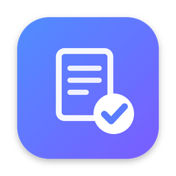
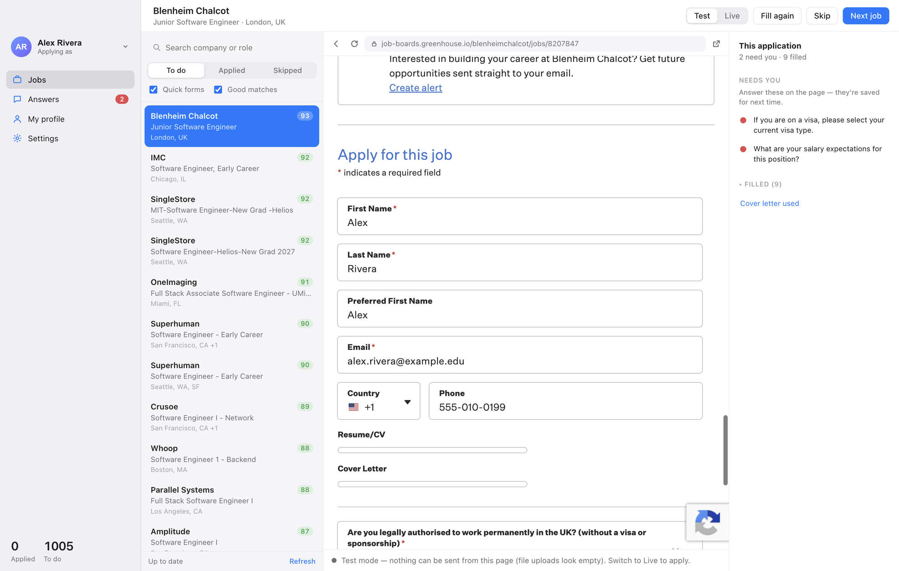
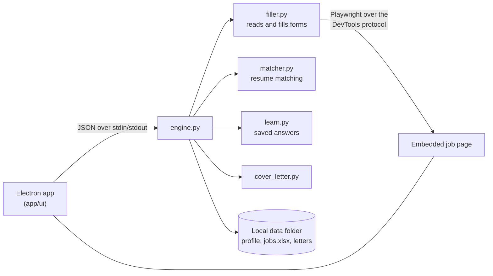

<p align="center">
  
</p>

<h1 align="center">Apply</h1>

<p align="center">
  A Mac app that fills out new-grad software engineering applications for you.<br>
  You review every form and click Submit yourself.
</p>

<p align="center">
  <a href="https://github.com/lcoronelr/Applying/releases/latest/download/Apply.dmg"><b>Download for macOS</b></a>
  &nbsp;·&nbsp;
  <a href="#features">Features</a>
  &nbsp;·&nbsp;
  <a href="#how-it-works">How it works</a>
  &nbsp;·&nbsp;
  <a href="#building-from-source">Build from source</a>
</p>

<p align="center">
  <a href="https://github.com/lcoronelr/Applying/releases/latest"></a>
  
  
  
  <a href="LICENSE"></a>
</p>

<p align="center">
  
  <br>
  <sub>A real Greenhouse application, filled in Test mode with a sample profile. Best-matching jobs on the left, the live form in the middle, and only the questions that still need you on the right.</sub>
</p>

---

## Overview

Applying to new-grad roles means typing the same name, school, links, work-authorization answers and EEO
responses into hundreds of nearly identical forms. Apply does that part. It keeps a list of current entry-level
software engineering openings, ranks them against your resume, opens each application inside the app, and fills
in everything it knows about you. You check the form, answer anything new, and click the site's own Submit button.
The next job opens on its own.

It is built around one rule: **the app never submits an application for you.** While it is filling a form, the form
cannot be sent at all.

## Features

**Fills real application forms.** Text fields, dropdowns, radio buttons, checkboxes, date pickers, searchable
location and school boxes, resume and cover-letter uploads. Built for Greenhouse, Lever and Ashby, which cover most
new-grad postings, and works on many other sites.

**Finds the jobs.** New-grad software engineering roles are pulled automatically from three public, community-maintained
lists ([SimplifyJobs](https://github.com/SimplifyJobs/New-Grad-Positions),
[speedyapply](https://github.com/speedyapply/2027-SWE-College-Jobs),
[ApplyGuy](https://github.com/ApplyGuy/2027-New-Grad-Jobs)) and refreshed every 12 hours.

**Matches jobs to your resume.** Every posting gets a 0–100 score and a one-line reason, computed locally and for
free. Senior roles, roles that require years of experience, and roles that will not sponsor a visa (if you need one)
sink to the bottom.

**Learns your answers.** When a question has no saved answer, you answer it on the page. When you submit or move on,
that answer is saved and filled automatically the next time the question appears. Differently worded versions of
the same question receive your earlier answer as a highlighted suggestion.

**Never types into short dropdowns.** Dropdowns are answered by clicking one of their real options. If none of your
saved answers fits, the question is left for you instead of guessed.

**Writes cover letters.** From your own template with `{company}` and `{role}` placeholders, or from a personal
letter style that picks the stories from your experience that best fit each job. Output is a one-page PDF.

**Keeps a record.** A screenshot of every form you submit and of the confirmation page, plus every question and
answer, saved locally.

**Multiple people, one Mac.** Each person has their own profile, resume, answers, job list and letters.

**Optional Claude integration.** With an Anthropic API key, Claude drafts answers to questions you have never seen
(highlighted for review) and tailors each cover letter to the job posting. It never answers sponsorship,
citizenship, EEO, salary or signature questions.

## How it works

1. **Pick a job.** The list on the left is sorted by how well each role matches your resume.
2. **It fills itself in.** The application opens inside the app and every question with a known answer is filled.
3. **Answer what is left.** Anything new is outlined in red and listed on the right. Your answers are saved for next time.
4. **Submit it yourself.** Click the site's Submit button. Apply detects the confirmation page, records the
   application, and opens the next job after a short countdown you can cancel.

**Test mode** fills every form but blocks anything from being sent, so you can see exactly what would be submitted
before switching to **Live**. **Stop** halts filling at any moment.

## Installation

1. Download **[Apply.dmg](https://github.com/lcoronelr/Applying/releases/latest/download/Apply.dmg)**.
2. Open it and drag **Apply** into **Applications**.
3. Open Apply from Applications. On first launch, macOS may report that the app cannot be verified, because it is
   not distributed through the App Store. Open **System Settings → Privacy & Security** and choose **Open Anyway**.
   If macOS still refuses to open it, run this once in Terminal:

   ```bash
   xattr -dr com.apple.quarantine /Applications/Apply.app
   ```

4. Create your profile: contact details, education, work authorization, resume, and optionally a cover-letter template.

Requires a Mac with Apple silicon (M1 or newer). A step-by-step guide for new users is in [FRIENDS.md](FRIENDS.md).

## Job matching

Matching runs entirely on your Mac; no data leaves your computer. Posting text is read from each job board's public
API and compared with your resume.

| Signal | Effect on the score |
|---|---|
| Skills in the posting that also appear on your resume | Main component (about 45%) |
| How well the role's field fits your background | About 25% |
| Level: new grad and entry level versus senior, intern, or "3+ years required" | About 30% |
| Explicitly no visa sponsorship, U.S. citizenship or a security clearance required (when you need sponsorship) | Moved to the bottom |
| Export-controlled roles (ITAR), PhD or Master's required | Strong penalty |

Each score comes with its reason, for example *"Python, AWS, Java · new grad"* or *"needs 4+ yrs · no sponsorship"*.

## Privacy and safety

- **Nothing is submitted without you.** Submit events, clicks on Submit or Apply buttons, and the Enter key are all
  blocked while the app is filling a form. Only your own click after filling finishes sends an application.
- **Already-applied jobs are protected.** Opening a job you have applied to only shows the posting; nothing is filled.
- **Your data stays local.** Profiles, answers, job lists, letters and screenshots are stored in
  `~/Library/Application Support/Apply/Data`. The only network requests are to the job boards and the public job lists.
- **AI is optional and limited.** Without an API key, no AI is used. With one, legal and identity questions are never
  answered by the model, and every AI-written answer is highlighted for review.

## Building from source

Requirements: macOS, Python 3.11 or newer, Node.js 20 or newer.

```bash
git clone https://github.com/lcoronelr/Applying.git
cd Applying
./setup.command                 # Python environment and the Electron app
./Apply.command                 # run the app
.venv/bin/python -m pytest -q   # run the test suite
./build_dmg.sh                  # build build/release/Apply-<version>-arm64.dmg
```

A command-line version is also available:

```bash
.venv/bin/python bot.py fetch --source speedyapply      # also: newgrad, applyguy, intern
.venv/bin/python bot.py match                           # score jobs against your resume
.venv/bin/python bot.py apply --dry-run --limit 10      # fill forms without sending anything
```

## Architecture



The window is an Electron app. The job application is a real browser view embedded in that window. A Python engine,
bundled into the app with PyInstaller, connects to that view through Chromium's DevTools protocol using Playwright,
so the same form-filling code runs from the app and from the command line.

| Path | Purpose |
|---|---|
| `app/` | Electron app: window, embedded job page, interface (`ui/`) |
| `engine.py` | Backend the app runs; receives commands as JSON |
| `filler.py` | Scans any application form, fills it from saved answers, blocks submission while filling |
| `matcher.py` | Resume-to-job scoring |
| `learn.py` | Saves answers you give and suggests them for similar questions |
| `bot.py` | Job lists into `jobs.xlsx`, plus the command-line interface |
| `profiles.py` | People, their data folders, starter answers |
| `cover_letter.py` | One-page PDF cover letters |
| `ai.py` | Optional Claude features |
| `paths.py` | Where data is stored |
| `test_bot.py` | Test suite, including real browser tests |

**Built with** Electron, Python, Playwright, openpyxl, ReportLab, pypdf, PyInstaller and electron-builder.

## Limitations

- **macOS on Apple silicon only.** Windows and Intel builds are not provided yet.
- **Workday and similar portals** usually require creating an account first, so they fill only partially.
- **Unsigned by Apple.** The app is ad-hoc signed rather than notarized, which is why macOS asks for confirmation on first launch.

## Responsible use

Apply is a personal productivity tool. It is not affiliated with any employer, job board or applicant tracking
system. Review every application before you submit it, make sure every answer is accurate, and follow the terms of
the sites you apply through.

## License

Released under the [MIT License](LICENSE).

## Author

Built by [Luis Coronel](https://github.com/lcoronelr).
